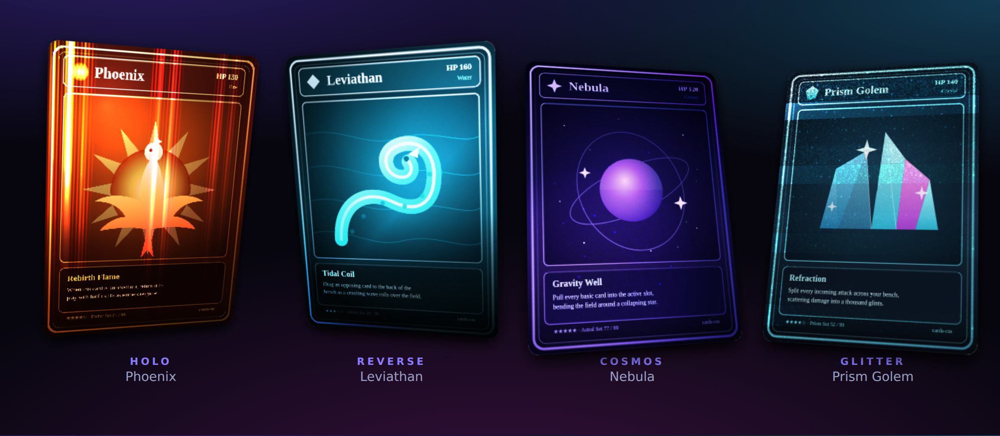

# cards-css

[](https://www.npmjs.com/package/@kongyo2/cards-css)
[](./LICENSE)

Framework-agnostic holographic trading-card effect — tilt, shine, glare and four
foils (`holo` / `reverse` / `cosmos` / `glitter`) that react to pointer and
gyroscope, with procedurally code-generated textures. No runtime dependencies.

[](https://kongyo2.github.io/cards-css/)

**[Live demo →](https://kongyo2.github.io/cards-css/)** — move the pointer across a card, or tilt your phone, to see the foil shift.

## Install

```sh
npm install @kongyo2/cards-css
```

## Quick start

```js
import { createHoloCard } from "@kongyo2/cards-css";
import "@kongyo2/cards-css/styles.css";

const card = createHoloCard({
  image: "/cards/phoenix.png",
  imageAlt: "Phoenix",
  effect: "holo",
});

document.querySelector("#stage").append(card.element);
```

`createHoloCard` builds the full element for you. To enhance markup you already
have on the page (it must contain the `.holo-card__rotator` structure), use
`attachHoloCard(element, options)` instead.

## Effects

Set via the `effect` option (or `card.setEffect(...)` at runtime):

| Effect    | Description                                                       |
| --------- | ---------------------------------------------------------------- |
| `none`    | Tilt, shine and glare only — no foil                             |
| `holo`    | Rainbow holographic foil                                         |
| `reverse` | Reverse-line holographic foil                                    |
| `cosmos`  | Galaxy / cosmos foil (procedural — needs `textureSeed`)      |
| `glitter` | Glitter / sparkle foil (procedural — needs `textureSeed`)    |

## Options

| Option            | Type      | Default  | Notes                                              |
| ----------------- | --------- | -------- | -------------------------------------------------- |
| `image`           | `string`  | —        | Front image source (required for `createHoloCard`) |
| `imageAlt`        | `string`  | `""`     | Alt text for the front image                       |
| `back` / `backAlt`| `string`  | —        | Optional card-back image and its alt text          |
| `className`       | `string`  | —        | Extra class names for the root element             |
| `effect`          | `HoloEffect` | `"none"` | One of the effects above                        |
| `interactive`     | `boolean` | `true`   | React to pointer move                              |
| `activateOnClick` | `boolean` | `false`  | Click to pop the card into a centered showcase     |
| `gyroscope`       | `boolean` | `true`   | Tilt to device orientation while active            |
| `showcase`        | `boolean` | `false`  | Auto-animate once on mount                         |
| `glow`            | `string`  | —        | CSS color for the card glow                        |
| `aspectRatio`     | `number`  | —        | Card aspect ratio (width / height)                 |
| `textureSeed`     | `number`  | —        | Seed for the generated `cosmos` / `glitter` textures; without it those two foils render without their procedural layers |
| `mask` / `foil`   | `string`  | —        | URLs for a mask / custom foil overlay              |

## API

- `createHoloCard(options)` → `HoloCard` — builds the element (`image` required).
- `attachHoloCard(element, options?)` → `HoloCard` — wraps existing markup.
- `HoloCard`
  - `element` — the root `HTMLElement` to mount.
  - `active` / `interacting` — state getters.
  - `activate()` / `deactivate()` — pop the card in / out of showcase.
  - `setEffect(effect)` — swap the foil at runtime.
  - `destroy()` — remove listeners and reset the element.

On iOS, gyroscope access needs a one-time permission prompt triggered by a user
gesture — call `requestOrientationPermission()` (exported) from a click/tap
handler.

## Releasing

Publishing is manual: the **Publish to npm** GitHub Action
(`.github/workflows/publish.yml`) only runs on `workflow_dispatch`.

One-time setup — add an npm token as a repository secret:

1. Create an npm **Automation** (or Granular Access, with publish rights) token
   at <https://www.npmjs.com/settings/~/tokens>.
2. In the repo, go to **Settings → Secrets and variables → Actions → New
   repository secret** and add it as `NPM_TOKEN`.

To cut a release:

1. Bump the version locally and push the tag:
   ```sh
   npm version patch   # or minor / major
   git push --follow-tags
   ```
2. Open the **Actions** tab → **Publish to npm** → **Run workflow**, choose the
   dist-tag (`latest` / `next` / `beta`), and optionally tick **Dry run** to
   verify the pipeline without publishing.

The workflow typechecks, builds, verifies the publish artifacts, then runs
`npm publish` with [provenance](https://docs.npmjs.com/generating-provenance-statements)
(enabled by the `id-token: write` permission). `npm publish` rejects a version
that already exists, so remember to bump first.

## License

[MIT](./LICENSE) © kongyo2
